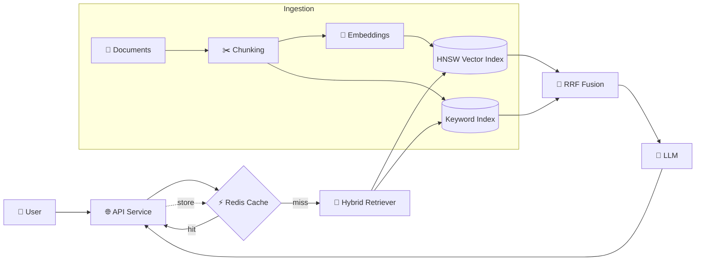

<div align="center">

# 🔎 <YOUR-PROJECT-NAME>

### Production-grade Retrieval-Augmented Generation with Hybrid Search, Semantic Caching & Cloud Deployment

*Ask questions over your own documents — grounded answers, sub-second cached responses, deployed on AWS.*

<p>
  
  
  
  
  
</p>

<p>
  
  
  
</p>

[**🚀 Live Demo**](#) · [**📖 API Docs**](#) · [**🏗 Architecture**](#-architecture) · [**⚡ Quick Start**](#-quick-start)

<!-- Replace with a real screenshot or GIF: -->
<!--  -->

</div>

---

## 📌 Overview

**<YOUR-PROJECT-NAME>** is an end-to-end RAG system that turns unstructured documents into a fast, accurate, question-answering service. It goes beyond a basic "embed → top-k → LLM" pipeline by combining:

- **Hybrid retrieval** — dense vector search (HNSW) fused with keyword search via **Reciprocal Rank Fusion (RRF)**
- **Redis caching layer** — repeated and similar queries return instantly, cutting latency and LLM cost
- **Containerized, cloud-native deployment** on **AWS ECS**

> **Why it matters:** Pure vector search misses exact terms (IDs, error codes, names); pure keyword search misses meaning. Hybrid + RRF gets the best of both, and caching keeps it cheap and fast in production.

---

## ✨ Key Features

| | Feature | Description |
|---|---|---|
| 🧠 | **Hybrid Search** | Dense (semantic) + sparse (keyword) retrieval merged with RRF for higher recall and precision |
| 🕸️ | **HNSW Index** | Approximate nearest-neighbour search with tunable `M` / `ef` parameters for speed vs. accuracy |
| ⚡ | **Redis Caching** | Low-latency cache for query results and responses, with TTL-based invalidation |
| 📄 | **Document Ingestion** | Load → chunk → embed → index pipeline |
| 🔗 | **Grounded Answers** | Responses generated strictly from retrieved context, with source references |
| 🐳 | **Containerized** | Reproducible builds with Docker |
| ☁️ | **Cloud Deployed** | Running on AWS ECS with environment-based configuration |

---

## 🏗 Architecture



### Request lifecycle

1. **Query arrives** at the API.
2. **Cache lookup** in Redis — a hit returns immediately.
3. On a miss, the **hybrid retriever** runs dense (HNSW) and keyword search in parallel.
4. Results are merged with **Reciprocal Rank Fusion**:

   ```
   RRF(d) = Σ  1 / (k + rank_i(d))
   ```

5. Top chunks are passed to the **LLM** as context.
6. The answer is **cached** and returned with source citations.

---

## 🛠 Tech Stack

| Layer | Technology |
|---|---|
| **Language** | Python |
| **Vector Search** | HNSW (Hierarchical Navigable Small World) |
| **Retrieval Strategy** | Hybrid search · Reciprocal Rank Fusion (RRF) |
| **Caching** | Redis |
| **Containerization** | Docker |
| **Cloud / Deployment** | AWS ECS |
| **LLM** | `<your LLM, e.g. OpenAI / Claude / Llama>` |
| **Embeddings** | `<your embedding model>` |
| **API Framework** | `<e.g. FastAPI>` |
| **Vector Store** | `<e.g. Redis Stack / pgvector / Qdrant>` |
| **Orchestration** | `<e.g. LangChain / LlamaIndex / custom>` |
| **CI/CD** | `<e.g. GitHub Actions>` |

---

## 📊 Performance

<!-- Fill in with your real measurements — recruiters love numbers. -->

| Metric | Result |
|---|---|
| Cache-hit latency | `~__ ms` |
| Cache-miss end-to-end latency | `~__ s` |
| Retrieval quality (Recall@k / MRR) | `__` (hybrid) vs `__` (vector-only) |
| Cache hit rate | `__ %` |
| LLM cost reduction from caching | `__ %` |

---

## ⚡ Quick Start

### Prerequisites
- Python 3.11+
- Docker & Docker Compose
- Redis (or use the provided compose file)
- API key for your LLM provider

### 1. Clone
```bash
git clone https://github.com/<your-username>/<your-repo>.git
cd <your-repo>
```

### 2. Configure
```bash
cp .env.example .env
# edit .env with your keys and settings
```

### 3. Run with Docker
```bash
docker compose up --build
```

### 4. Ingest documents
```bash
python -m app.ingest --path ./data/docs
```

### 5. Ask a question
```bash
curl -X POST http://localhost:8000/query \
  -H "Content-Type: application/json" \
  -d '{"question": "What does the document say about X?"}'
```

---

## 🔌 API Reference

| Method | Endpoint | Description |
|---|---|---|
| `POST` | `/query` | Ask a question, returns answer + sources |
| `POST` | `/ingest` | Add documents to the index |
| `GET` | `/health` | Service health check |

<details>
<summary><b>Example response</b></summary>

```json
{
  "answer": "…grounded answer…",
  "sources": [
    { "doc": "handbook.pdf", "chunk": 12, "score": 0.032 }
  ],
  "cached": false,
  "latency_ms": 840
}
```
</details>

---

## ☁️ Deployment (AWS ECS)

```
Docker image ──▶ Container Registry ──▶ ECS Task Definition ──▶ ECS Service ──▶ Load Balancer
```

1. Build and push the image to your container registry.
2. Register an ECS task definition (CPU/memory, env vars, secrets).
3. Run as an ECS service behind a load balancer.
4. Redis endpoint and API keys are injected via environment variables / secrets.

---

## 🗂 Project Structure

```
.
├── app/
│   ├── api/            # HTTP routes
│   ├── retrieval/      # HNSW search, keyword search, RRF fusion
│   ├── cache/          # Redis caching layer
│   ├── ingestion/      # loaders, chunking, embeddings
│   └── llm/            # prompt + generation
├── deploy/             # ECS task definition, infra config
├── tests/
├── Dockerfile
├── docker-compose.yml
└── README.md
```

---

## 🧪 Testing

```bash
pytest tests/ -v
```

---

## 🗺 Roadmap

- [x] Hybrid retrieval with RRF
- [x] Redis caching
- [x] Dockerized + deployed on AWS ECS
- [ ] Re-ranking with a cross-encoder
- [ ] Streaming responses
- [ ] Evaluation dashboard (Recall@k, faithfulness)
- [ ] Observability (tracing, metrics)

---

## 🤝 Contributing

Contributions are welcome. Fork the repo, create a feature branch, and open a pull request.

## 📄 License

Distributed under the MIT License. See `LICENSE` for details.

---

<div align="center">

### 👨‍💻 Built by **Tark Patel**

[](https://linkedin.com/in/<your-handle>)
[](https://github.com/pateltark)

⭐ *If you found this useful, consider giving it a star!*

</div>
